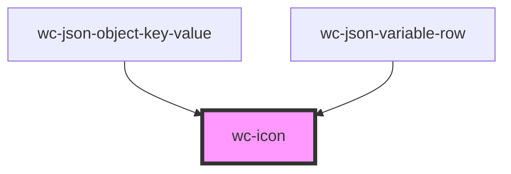

# wc-icon

<!-- Auto Generated Below -->

## Properties

| Property | Attribute | Description | Type     | Default     |
| -------- | --------- | ----------- | -------- | ----------- |
| `color`  | `color`   |             | `string` | `'#181818'` |
| `size`   | `size`    |             | `string` | `'16px'`    |
| `type`   | `type`    |             | `any`    | `undefined` |

## Dependencies

### Used by

 - [wc-json-object-key-value](../json-object-key-value)
 - [wc-json-variable-row](../json-variable-row)

### Graph

----------------------------------------------

*Built with [StencilJS](https://stenciljs.com/)*
