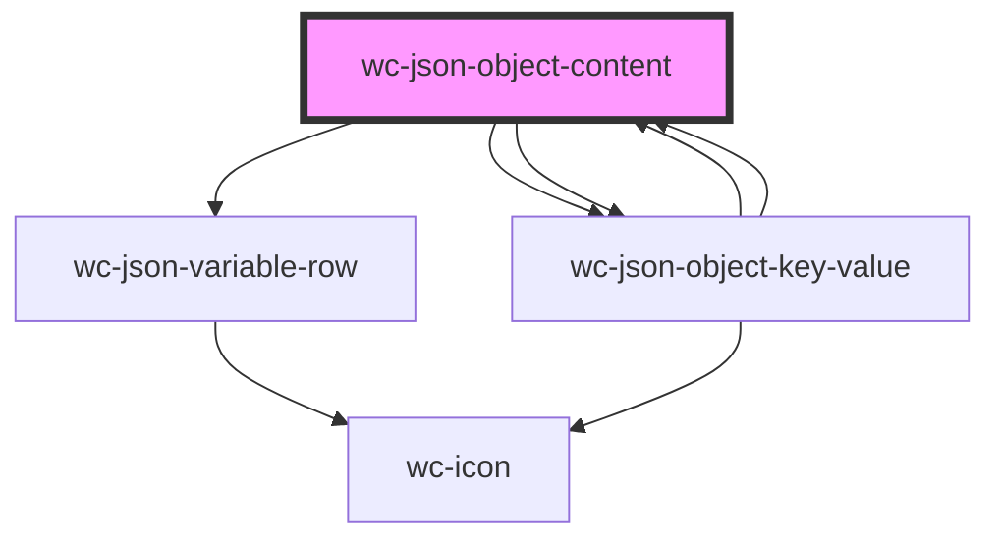

# wc-json-object-content

<!-- Auto Generated Below -->

## Properties

| Property          | Attribute        | Description | Type       | Default     |
| ----------------- | ---------------- | ----------- | ---------- | ----------- |
| `addAble`         | `add-able`       |             | `boolean`  | `undefined` |
| `addData`         | --               |             | `Function` | `undefined` |
| `canDrag`         | `can-drag`       |             | `boolean`  | `undefined` |
| `collapsed`       | `collapsed`      |             | `any`      | `undefined` |
| `data`            | --               |             | `Object`   | `undefined` |
| `dragData`        | --               |             | `Function` | `undefined` |
| `dropZonePath`    | `drop-zone-path` |             | `string`   | `undefined` |
| `editAble`        | `edit-able`      |             | `boolean`  | `undefined` |
| `editData`        | --               |             | `Function` | `undefined` |
| `path`            | `path`           |             | `string`   | `''`        |
| `removeAble`      | `remove-able`    |             | `boolean`  | `undefined` |
| `removeData`      | --               |             | `Function` | `undefined` |
| `setDropZonePath` | --               |             | `Function` | `undefined` |

## Dependencies

### Used by

 - [wc-json-object-key-value](../json-object-key-value)

### Depends on

- [wc-json-variable-row](../json-variable-row)
- [wc-json-object-key-value](../json-object-key-value)
- [wc-json-object-key-value](../json-object-key-value)

### Graph

----------------------------------------------

*Built with [StencilJS](https://stenciljs.com/)*
