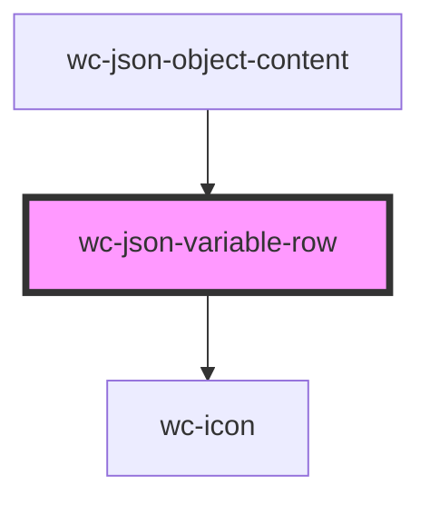

# wc-json-variable-row

<!-- Auto Generated Below -->

## Properties

| Property     | Attribute     | Description | Type       | Default     |
| ------------ | ------------- | ----------- | ---------- | ----------- |
| `canDrag`    | `can-drag`    |             | `boolean`  | `undefined` |
| `editAble`   | `edit-able`   |             | `boolean`  | `undefined` |
| `editData`   | --            |             | `Function` | `undefined` |
| `jsonKey`    | `json-key`    |             | `string`   | `undefined` |
| `jsonVal`    | `json-val`    |             | `any`      | `undefined` |
| `path`       | `path`        |             | `string`   | `undefined` |
| `removeAble` | `remove-able` |             | `boolean`  | `undefined` |
| `removeData` | --            |             | `Function` | `undefined` |
| `selectNode` | --            |             | `Function` | `undefined` |

## Dependencies

### Used by

 - [wc-json-object-content](../json-object-content)

### Depends on

- [wc-icon](../icon)

### Graph

----------------------------------------------

*Built with [StencilJS](https://stenciljs.com/)*
