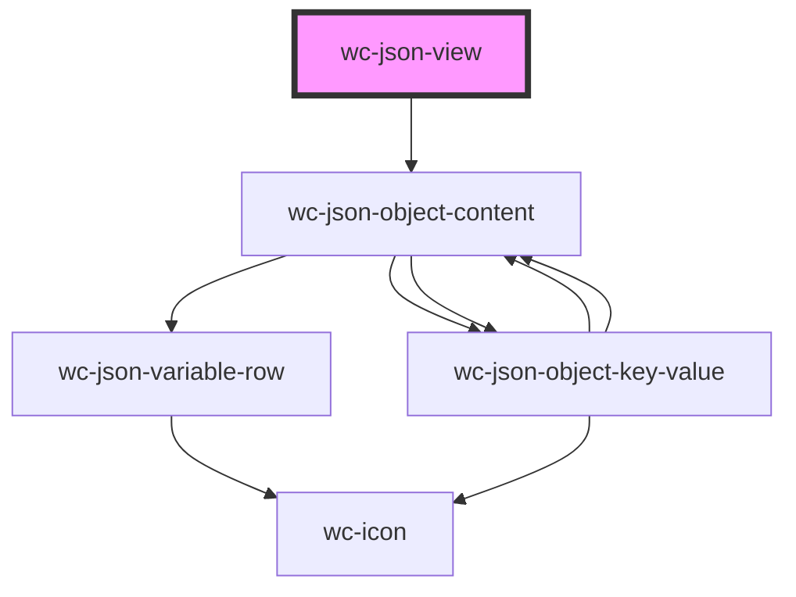

# wc-json-view

<!-- Auto Generated Below -->

## Properties

| Property     | Attribute     | Description | Type      | Default |
| ------------ | ------------- | ----------- | --------- | ------- |
| `addAble`    | `add-able`    |             | `boolean` | `false` |
| `canDrag`    | `can-drag`    |             | `boolean` | `false` |
| `data`       | --            |             | `object`  | `data`  |
| `editAble`   | `edit-able`   |             | `boolean` | `false` |
| `removeAble` | `remove-able` |             | `boolean` | `false` |

## Methods

### `editData(path: any, value: any) => Promise<void>`

#### Returns

Type: `Promise<void>`

## Dependencies

### Depends on

- [wc-json-object-content](../json-object-content)

### Graph

----------------------------------------------

*Built with [StencilJS](https://stenciljs.com/)*
