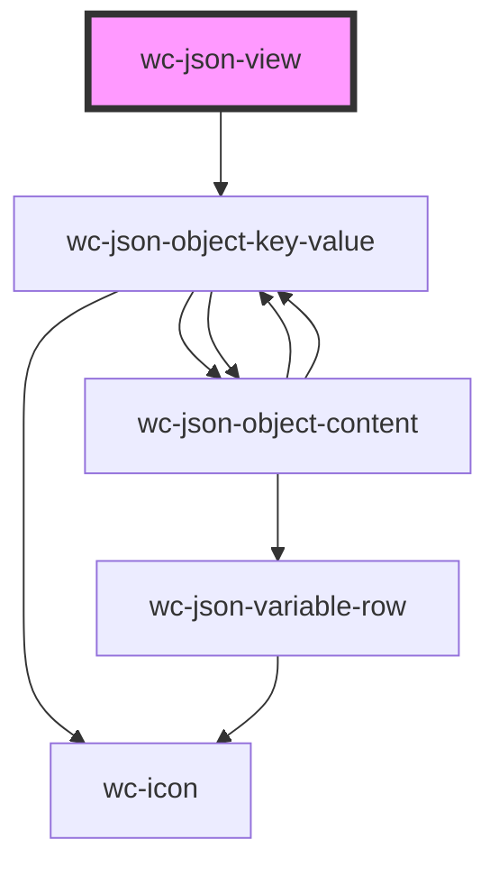

# wc-json-view

<!-- Auto Generated Below -->

## Properties

| Property     | Attribute     | Description | Type                | Default     |
| ------------ | ------------- | ----------- | ------------------- | ----------- |
| `addAble`    | `add-able`    |             | `boolean`           | `false`     |
| `canDrag`    | `can-drag`    |             | `boolean`           | `false`     |
| `collapsed`  | `collapsed`   |             | `boolean \| string` | `'1'`       |
| `datas`      | `datas`       |             | `string`            | `undefined` |
| `editAble`   | `edit-able`   |             | `boolean`           | `false`     |
| `removeAble` | `remove-able` |             | `boolean`           | `false`     |

## Events

| Event        | Description | Type               |
| ------------ | ----------- | ------------------ |
| `selectNode` |             | `CustomEvent<any>` |

## Dependencies

### Depends on

- [wc-json-object-key-value](../json-object-key-value)

### Graph

----------------------------------------------

*Built with [StencilJS](https://stenciljs.com/)*
